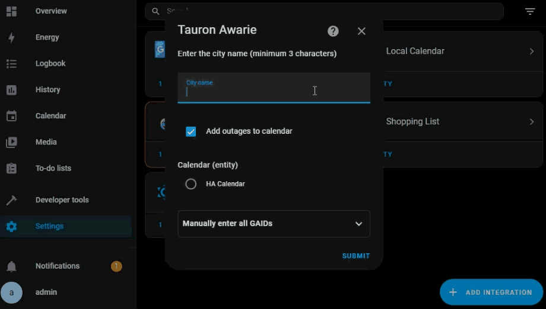
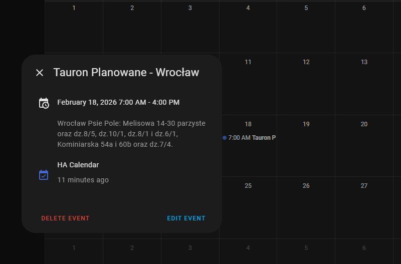

# Tauron Awarie (Home Assistant)

Home Assistant integration for Tauron power outage information. Based on your location provided during setup, the integration queries the unofficial Tauron Dystrybucja API every 12 hours to check for any planned power outages or ongoing outages for the specified area within the next 7 days. If you select this option in the configuration, such an event will be added to your calendar.

##### 🇵🇱 Polska wersja dokumentacji jest dostępna [tutaj](./README.pl.md).

## Features

- **Real-time Outage Monitoring**: Fetches current and planned power outages from Tauron Dystrybucja's API
- **Location-based Filtering**: Configure for specific cities, districts, and communes in Poland
- **Calendar Integration**: Automatically create calendar events for planned outages
- **Polish Localization**: Full Polish language support

## Installation

### HACS (Recommended)

1. Add this repository to HACS as a custom repository
2. Search for "Tauron Awarie" in the HACS integrations
3. Install and restart Home Assistant
4. Add the integration through the UI

### Manual Installation

1. Copy the `custom_components/tauron_awarie` folder to your Home Assistant `custom_components` directory
2. Restart Home Assistant
3. Add the integration through the UI

## Configuration

The integration uses Tauron WAAPI to fetch outage data. Configuration involves:

1. **City Selection**: Search and select your city
2. **District Selection**: For cities with multiple districts (like Wrocław), choose your specific area
3. **Calendar Integration**: Optionally enable calendar event creation for planned outages

### Configuration Options

- **City Search**: Type at least 3 characters to search for Polish cities
- **Manual GAID Entry**: Advanced option to manually enter GAID codes if automatic search doesn't work
- **Calendar Creation**: Toggle to create calendar events for outages

## Sensors

The integration provides a sensor that shows:

- Days until the next planned outage
- Detailed outage information (start time, end time, description, type)
- List of all upcoming outages
- Location information (province, district, commune, city)

### Sensor Attributes

- `next_start`: ISO timestamp of next outage start
- `next_end`: ISO timestamp of next outage end
- `next_message`: Description of the outage location/details
- `next_type`: Type of outage (Planowane/Awaryjne)
- `outage_count`: Total number of upcoming outages
- `outages`: Array of all outage objects

## Calendar Events

When calendar integration is enabled, the integration creates timed events for planned outages with:

- Summary: "Tauron [Type] - [City Name]"
- Description: Outage location details
- Start/End times: Exact outage schedule

> [!TIP]
> You can use additional HA integrations to better present data on your dashboard. For example, [hassio-trash-card](https://github.com/idaho/hassio-trash-card)

## Requirements

- Home Assistant 2025.2.4 or later

## FAQ

* **What should I do if my city isn't listed?**

The local city database may be incomplete. If your city isn't listed, you can use the "Manually add GAID" option, which is visible when adding entities. To obtain the appropriate GAID for your place of residence, you must extract it from the URL address of the application on the website https://www.tauron-dystrybucja.pl/wylaczenia in the "Check exclusions for the district or municipality" section.

* **My electricity supplier is Energa. What about me?**

 That's great, because this integration is based on an original idea by @chauek, who created this [integration of outage information for the Energa supplier](https://github.com/chauek/energa_awarie).

* **I added my location, but no outages or interruptions were added to the calendar. Why?**

This almost certainly means that there are no planned outages for the next 7 days. And that no outages are currently occurring.

* **How often does Home Assistant update information from the API about outages and malfunctions?**

To conserve Tauron Dystrybucja server resources, updates occur once every 12 hours. For the same reason, this integration also has a built-in (quite extensive) database of Tauron-specific city identifiers.

## Support

- [GitHub Issues](https://github.com/l4red0/tauron_awarie/issues) for bug reports and feature requests
- [Home Assistant Community](https://community.home-assistant.io) for general HA questions

#### Disclaimer

This integration is not officially affiliated with Tauron Dystrybucja. Use at your own risk. The authors are not responsible for any damages or issues caused by the use of this integration.
#### License

This project is licensed under the MIT License - see the [LICENSE](LICENSE) file for details.

